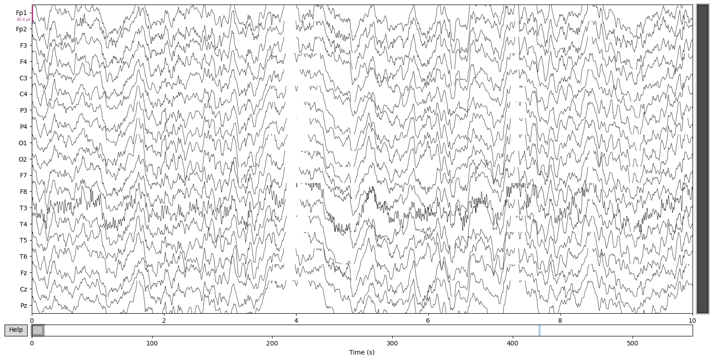
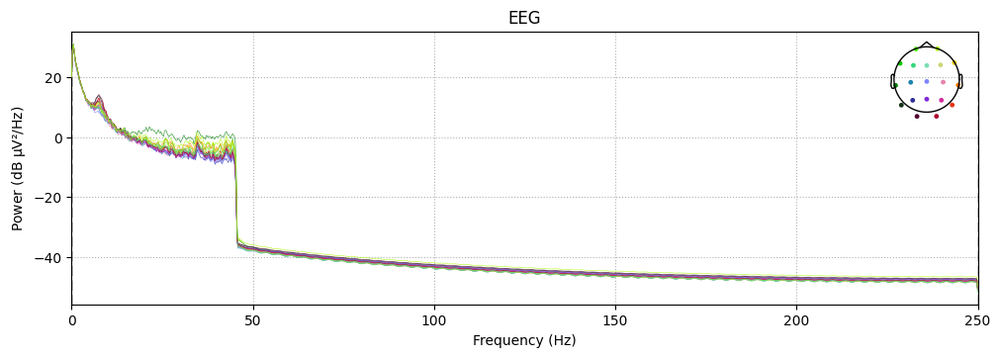
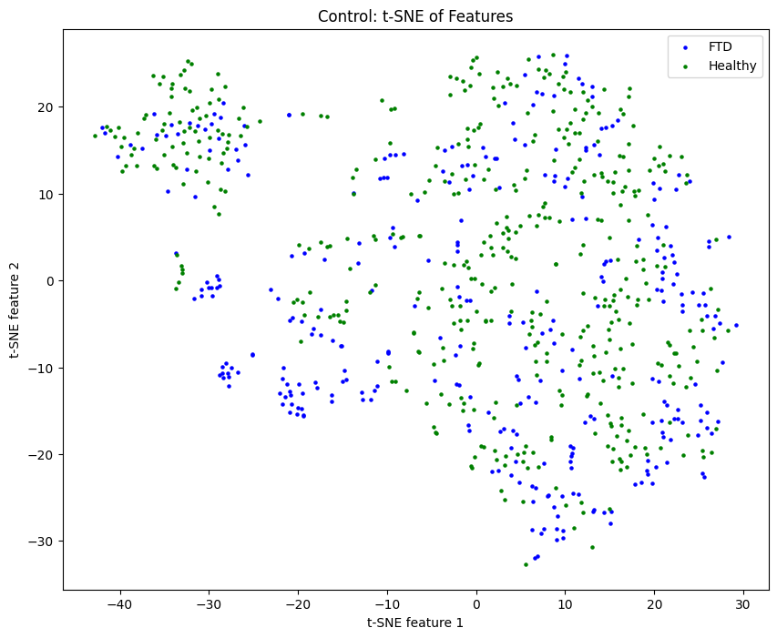
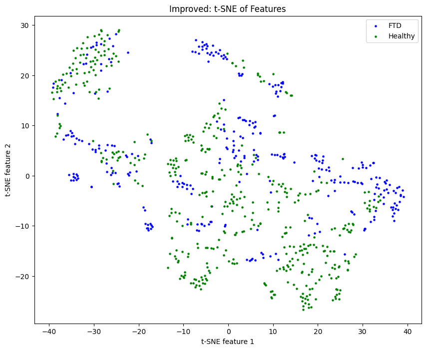

# EEG Feature Classification

## Summary
Frontotemporal dementia (FTD) is a type of dementia making up a significant portion (about 10\%-20\%) of all dementia cases today. However, diagnosis has proven to be difficult.

This project classifies EEG features from frontotemporal dementia and healthy subjects, revealing specific brain qualities that guide the model's decisions. It bridges raw clinical data and patient care by turning EEG signals into human-readable insights. By **improving the explainability and trustworthiness** of diagnosis models, this research ultimately supports **more informed and reliable patient care**.

## How does it work?

### Data Loading
EEG (electroencephalogram) data is loaded from the AHEPA dataset, including recordings from Alzheimer's disease, Frontotemporal dementia, and healthy subjects. Data includes 19 distinct EEG channel (sensor) time-series.

    
    
<em>Figure: EEG data</em>

### Preprocessing
The dataset is already preprocessed (removed noise and artifacts, then filtered).

    
    
<em>Figure: Initial Power Spectral Density (PSD) of EEG data.</em>

The data is segmented into epochs (time segments). Channels are then categorized into 6 brain regions:
- **Pre-frontal (PF)**: Fp1, Fp2
- **Frontal (F)**: F7, F3, Fz, F4, F8
- **Temporal (T)**: T3, T4, T5, T6
- **Central (C)**: C3, Cz, C4
- **Parietal (P)**: P3, Pz, P4
- **Occipital (O)**: O1, O2

### Feature Extraction
Features are extracted from the EEG data using Discrete Wavelet Transform (DWT), into 5 frequency bands:

- **Delta** (0.5-4 Hz)
- **Theta** (4-8 Hz)
- **Alpha** (8-12 Hz)
- **Beta** (12-24 Hz)
- **Gamma** (24-48 Hz)

4 features are extracted from each frequency band:
- **Logarithmic Band Power** (LBP)
- **Variance** (Var)
- **Kurtosis** (Kur)
- **Shannon Entropy** (SE)

    
    
<em>Figure: Features</em>

For each 50s epoch, we have:
6 regions * 5 frequency bands * 4 feature metrics = **120 features**

### Leave-One-Out Classification
Leave-one-out cross-validation is used to assess the classification performance. The process involves the following steps:

1. **Control Classification**:
    - Classify using all 120 features.
    - Evaluate using K-Nearest Neighbors (KNN) to measure accuracy, sensitivity, and specificity.

2. **Feature Contribution Analysis**:
    - For each brain region, frequency band, and metric, leave one out and classify using the remaining features.
    - Evaluate using KNN to measure accuracy, sensitivity, and specificity.
    - Subtract these performance metrics from the control to determine the contribution of each feature.

This method helps identify the significance of individual features in the classification process.

### t-SNE Visualization
t-SNE is used to visualize the clustering of classes in the featureset (in 2d). A visualization is computed for the control featureset before feature optimization and then after insignificant/detrimental features are removed.

    
    

*Left: Control featureset, showing extremely scattered data. Right: Optimized featureset, showing much more clustering.*

## License
This project uses the MIT license. Check details in `LICENSE`.
